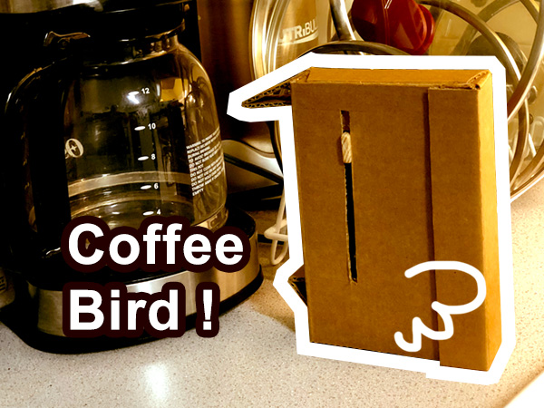

## How to run
> Steps to start the project from scratch
>> You need:
>> * An AWS account and AWS CLI set up locally
>> * An Arduino Yun
>> * A computer ( I have a mac )
>> * A coffee machine with a transparent pot
>> * A router and internet connection
>> * You also need the iot device set-up and ready ( not covered here )
> 1. Deploy the lambda function by running the [./publish.sh] script
> 2. Set up the yûn by reseting and then connecting to its wifi network and then: http://192.168.240.1
> 3. Deploy the [ServerLess](./sls/) api (`sls deploy`)
> 4. Add the endpoint you got on the output of above command to the [reporter.ino](./ino/)
> 5. Upload the [reporter.ino](./ino/) to Yûn and put it in front of your coffee pot
>> You may need to calibrate the threshold of the sensor according to your coffee machine!

## Tutorials:

In addition of a lot of API documentation, my own experience and also try and fails I followed these tuts n docs to get everything up and running:

*
* https://www.arduino.cc/en/Guide/ArduinoYun
* http://www.instructables.com/id/Arduino-Using-AWS-IoT-Serivce/
* https://www.hackster.io/circuito-io-team/simple-arduino-uno-esp-8266-integration-dba10b
* https://github.com/Circuito-io/ESP8266_SoftwareSerial